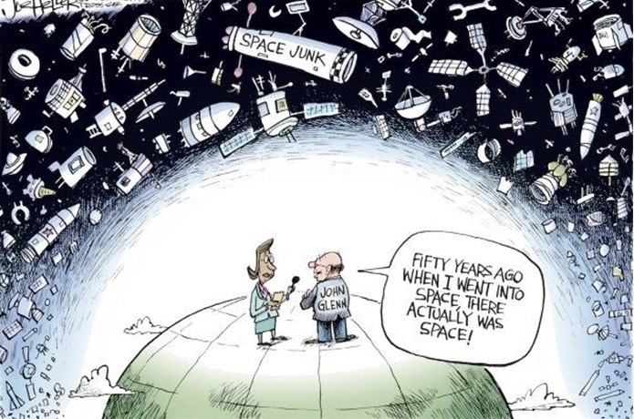

# StorytellingWithData
Spring 2019 Storytelling with Data class

The main project delivered for this class was an Analytical program to better measure space debris.

## INTRO: 
The exponential increase in yearly rocket launches and deployments of in- orbit assets has made it necessary for us to understand the limits to which human activity should pollute space. This project will look at the historical growth of space asset deployment, project the continuation of launches in the future, and propose solutions for which we can better control polluting the space outside of earth’s atmosphere. This analysis will add context to amount of assets that are currently in space, the amount of new objects slated for launch in the near future, how many decayed objects will this lead to in the future (space debris), and whether current coordination efforts are impactful in controlling this risk. With this information, NASA, the US Government, and international space agencies will be better prepared to come to an agreement of utilizing space while protecting any adverse impacts of too many objects being deployed.
 
## CHALLENGE/ OPPORTUNITY: 
The science community has educated us into the critical levels of spatial density for which we need to be concerned. As described by Dr. Donald J Kessler, the Earth was at a critical level at LEO (Low Earth Orbit) for decades, with the orbiting altitude between 900 - 1400 km (and specifically between 900 to 1000 km) have been in the unstable region . The studies of Dr. Kessler led to initiatives such as the Orbital Degree Space Program  and the Inter- Agency Space Debris Coordination Committee . However, in today’s age of ever-expanding space technologies (as well as earth’s reliance on that space technology) as well as the rise of the commercial space industry. The analysis proposed here is going look at trends pertaining to the number of planned rocket launches and their relative size/ debris calculation compared to critical limits understood with current science. 
 
## RATIONAL: 
This analysis will continue to grow on our knowledge of optimal management of in space assets to better understand proper guidelines for human use of space. It will take into consideration the increase in planned rocket launches in the coming years as well the changes in the payloads deployed by those launches. The study will judge the effectiveness of current space debris coordination efforts and whether they are sustainable with the increase use of earths orbit for human technology. 
 
## COST ANALYSIS: 
The currently known in orbit data is open source, therefore the data pertaining to historical launches and the vehicles used in them will not be difficult to get. The most cost impactful area of this study will be future projections of orbital space debris creation and accuracy of current space debris in orbit. Currently stated numbers of space debris orbiting the earth are projections, therefore the study has avenues to utilize sophisticated yet cost intensive modeling methods to build on currently used tools for this purpose (for example, the LEGEND and ORDEM 3.0 models made by the Orbital Space Degree program ).  
 
## ASSESMENT: 
This study will be judged on the results from implementations of its suggestions in relation to risks realized from increasing space debris. The judgment could come from multiple factors:
•	The decrease and normalization of space capacity utilization
•	The crashing of space debris to other vehicles in space after recommendations implemented
•	The destruction of earth’s environment due to crashing decay (this would be a failure of the overall science community as it has been repeatedly assured that this poses little risk to earth).
•	Accuracy of launch count and vehicle type projections and their rate of decay in space.  
 
## CONCLUSION: 
The often-referenced Moore’s Law has driven humanity to technological levels exhibiting our unlimited capacity for innovation. Space has been a direct beneficiary in this exponential growth, which leaves us with the responsibility to cultivate this technological growth in the most effective way. A critical component of this is keeping the earth’s orbit usable and not letting our own innovations make growth in space more difficult than it already is. Studies such as this will help us in achieving the goal of having the space around our planet be usable for future innovations, explorations, and for the evolution of mankind’s grasp of our universe. 

